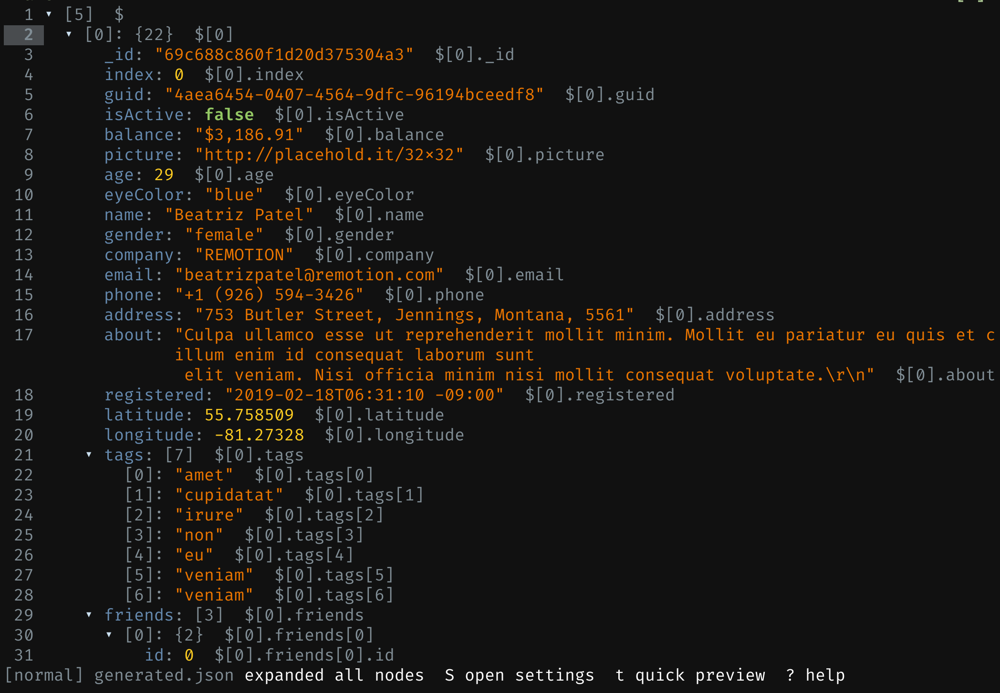

# lazy-json

[](https://github.com/anyroad/lazy-json/actions/workflows/ci.yml?query=branch%3Arelease)
[](docs/badges/coverage.svg)
[](https://github.com/anyroad/lazy-json/releases)
[](https://go.dev/dl/)

`lazy-json` is a keyboard-first JSON viewer and editor for the terminal, built with Go and Bubble Tea. It focuses on structured JSON editing instead of raw text editing: move around a tree, expand and collapse nodes, search, edit scalars, add and remove nodes, hand subtrees to your external editor, and optionally run `jq` transforms without leaving the app.



The project name and keyboard-first workflow are inspired by [LazyVim](https://github.com/LazyVim/LazyVim) and [lazygit](https://github.com/jesseduffield/lazygit): fast navigation, modal interactions, and useful shortcuts over heavyweight UI.

## Features

- tree-first navigation with `h/j/k/l`, `ctrl+b` / `ctrl+f`, `gg`, and `G`
- prefix shortcuts for clipboard actions, structural jumps, and tree-wide expand/collapse
- ordered object rendering with syntax highlighting, built-in themes, and persistent editor settings
- collapse and expand for objects and arrays
- long arrays expand into 100-item batch rows instead of dumping every element at once
- substring search with `/`, `n`, and `N`
- structured editing for scalars, object keys, object fields, and array items
- Vim-style undo/redo for document changes with `u`, `U`, and `ctrl+r`
- configurable pretty-printed JSON saves
- file-backed and stdin-backed sessions
- optional subtree editing through `$EDITOR`
- optional `jq` transforms through `:jq` and `:jq!`

## Installation

### Install with Homebrew (recommended)

```bash
brew tap anyroad/apps
brew install lazy-json
lazy-json --version
```

You can also install directly without a separate tap step:

```bash
brew install anyroad/apps/lazy-json
```

### Install with Go

```bash
go install github.com/anyroad/lazy-json@latest
lazy-json --version
```

### Download a release from GitHub

Download the archive for your platform from [GitHub Releases](https://github.com/anyroad/lazy-json/releases), extract it, and place `lazy-json` somewhere in your `PATH`.

- macOS and Linux releases are published as `.tar.gz`
- Windows releases are published as `.zip`

### Build from a checkout

```bash
git clone https://github.com/anyroad/lazy-json.git
cd lazy-json
make build
./dist/lazy-json testdata/basic.json
```

### Build directly with Go

```bash
go build -o dist/lazy-json .
./dist/lazy-json testdata/basic.json
```

## Quick Start

### Open a file

```bash
lazy-json data.json
```

### Open a file with a startup selection

```bash
lazy-json --select '$.items[0].name' data.json
```

### Open JSON from stdin

```bash
cat data.json | lazy-json
```

### Open stdin with a startup selection

```bash
cat data.json | lazy-json --select '$.items[0].name'
```

### Optional tools

- `jq` enables `:jq` and `:jq!` transform commands
- `$EDITOR` enables subtree editing with `E`

## User Guide

### Session types

`lazy-json` starts in one of two modes:

- file-backed: `lazy-json data.json`
- stdin-backed: `cat data.json | lazy-json`

File-backed sessions save back to the original path with `:w`. Stdin-backed sessions do not have a default file target, so use `:w path.json` to save to disk or `:print` to write the current document to stdout.

You can add `--select '$.path.to.node'` to either startup form to open with a specific node selected. The accepted syntax matches the paths shown in the tree, such as `$.items[0].name` and `$["two words"]`. If the full path does not exist, `lazy-json` falls back to the nearest existing ancestor; if only `$` exists, it still opens and shows an error in the footer.

### Navigation

- `j` / `k`: move the selection up or down through visible rows
- `h`: collapse the current container, or move to the parent row
- `l`: expand the current container, or move into the first child
- arrays longer than 100 items expand into batch rows such as `[0-99]`; use `l` to open a batch and `h` to close or leave it
- `ctrl+b` / `ctrl+f` or `pgup` / `pgdown`: page up or down by the current viewport height
- `gg` / `G`: jump to the first or last visible row
- `]p`: jump to the next parent sibling node, climbing ancestors until a next sibling is found
- `zR` / `zM`: expand all containers / collapse all containers except the root
- `za`: expand the selected array, or nearest array ancestor, so each container element opens one level; for batched arrays this applies to the selected batch, or the first batch from the array row
- `zA`: collapse the selected array, or nearest array ancestor, so all element containers close
- `?`: open the built-in help screen
- `t`: quick-preview the next theme for the current session
- `S`: open the settings dialog

### Editing model

The editor is structured, not freeform. You operate on the selected node:

- `u`: undo the last document change
- `U` / `ctrl+r`: redo the last undone document change
- `e`: edit the selected scalar value as JSON, such as `"text"`, `42`, `true`, or `null`
- `a`: add a new field to an object or append a new value to an array
- `r`: rename the selected object key
- `d`: delete the selected node
- `E`: serialize the selected node or subtree into a temp file, open it in `$EDITOR`, and replace the node only if the edited JSON parses successfully

Batch rows are navigation-only placeholders for long arrays. You can still press `a` on a batch row to append to its parent array, but edit, rename, delete, and subtree-copy actions require a real node selection.

Undo and redo track document changes only. Navigation, folds, search query changes, theme previews, and settings changes are not part of edit history. Saving marks the current revision as the saved point instead of clearing history, so undoing back to that revision clears the dirty indicator.

This keeps edits valid and avoids the complexity of embedding a full text editor into the TUI.

### Clipboard

- `yp`: copy the selected JSON path
- `yk`: copy the selected object key
- `yv`: copy the selected value as compact JSON
- `ys`: copy the selected subtree as pretty JSON
- `yj`: copy the whole document as pretty JSON

All clipboard copies use structured JSON output rather than the rendered screen text. `yv` preserves valid JSON scalars and compact containers, while `ys` and `yj` use the same current pretty formatting as saves.

### Search

- `/`: open search
- `n`: jump to the next match
- `N`: jump to the previous match

Search matches nodes across the whole document based on keys, scalar values, and rendered JSON paths. When `n` or `N` lands on a match inside a collapsed subtree or inside a long-array batch, `lazy-json` automatically expands the necessary ancestors and the matching batch to reveal it.

### Commands

- `:w`: save to the current file path
- `:w path.json`: save to a specific path
- `:x`: save and quit for file-backed sessions; for stdin-backed sessions with no file path, print to stdout and quit
- `:print`: print pretty JSON to stdout and quit
- `:q`: quit if there are no unsaved changes
- `:q!`: quit without saving
- `:undo`: undo the last document change
- `:redo`: redo the last undone document change
- `:theme`: quick-preview the next theme without saving
- `:settings`: open the settings dialog
- `:select-path $.items[0].name`: select a node by JSON path using the same syntax as `--select`
- `:copy-path`: copy the selected JSON path
- `:copy-key`: copy the selected object key
- `:copy-value`: copy the selected value as compact JSON
- `:copy-subtree`: copy the selected subtree as pretty JSON
- `:copy-json`: copy the whole document as pretty JSON
- `:expand-all`: expand every object and array in the document
- `:collapse-all`: collapse every container except the root
- `:next-parent-sibling`: jump to the next sibling of the selected node's parent, climbing ancestors as needed
- `:edit-external`: same behavior as `E`
- `:jq EXPR`: apply a `jq` expression to the whole document
- `:jq! EXPR`: apply a `jq` expression to the selected subtree

### Settings

Press `S` or run `:settings` to open the settings dialog. The dialog currently exposes five rows:

- `Theme`: cycle built-in themes first and then valid external themes from your config directory
- `Line numbers`: toggle a global tree row-number gutter; collapsed rows still count, so visible numbering may have gaps
- `JSON path`: toggle whether rendered rows show the selected node path
- `Long strings`: toggle wrapping for displayed string scalar values only
- `Save indent`: choose `spaces:2`, `spaces:3`, `spaces:4`, or `tabs` for pretty JSON output

Inside the dialog:

- `up` / `down` or `j` / `k`: move between settings rows
- `left` / `right` or `h` / `l`: change the selected setting
- `enter` / `space`: cycle the selected setting
- `s`: save the current settings to `settings.json`
- `esc`: close the dialog without writing to disk

Theme previews, line-number visibility, JSON-path visibility, and long-string wrapping apply immediately to the current session. The current save-indent setting also applies immediately to later pretty JSON output from `:w`, `:x`, `:print`, `ys`, and `yj`. Theme, line-number visibility, JSON-path visibility, wrap, and save-indent changes are not persisted until you press `s` in the settings dialog, so the quick `t` / `:theme` shortcuts remain preview-only switches.

`lazy-json` stores theme, line-number visibility, JSON-path visibility, wrapping, and save-indent settings under `os.UserConfigDir()/lazy-json/settings.json` and discovers external themes from `os.UserConfigDir()/lazy-json/themes/*.json`. The exact base directory follows `os.UserConfigDir()` for your platform; for example, on Linux this is typically `~/.config/lazy-json/settings.json` and `~/.config/lazy-json/themes/`.

External theme files are JSON objects with a required `name` plus optional style slots such as `key`, `string`, `number`, `bool`, `null`, `muted`, `selected`, `search_hit`, `status`, `error`, `border`, `help`, and `prompt`. Each slot supports `foreground`, optional `background`, and optional `bold`. For example:

```json
{
  "name": "mist",
  "key": {
    "foreground": "#112233"
  },
  "selected": {
    "background": "#ddeeff",
    "bold": true
  }
}
```

### Examples

Edit a file and save it back:

```bash
lazy-json config.json
```

Pipe JSON in, modify it, then print the result:

```bash
cat config.json | lazy-json
```

Transform a whole document with `jq` inside the editor:

```text
:jq .items |= map(select(.enabled == true))
```

Transform just the selected subtree:

```text
:jq! .version = "2"
```

### Save behavior

Pretty JSON output follows the current `Save indent` setting from the settings dialog. That applies to file saves plus other pretty-output paths such as `:print`, `ys`, and `yj`. The tool still does not preserve the original whitespace layout, and long-string wrapping remains display-only.

## Developer Guide

### Make targets

- `make fmt`: rewrite Go files with `gofmt`
- `make fmt-check`: fail if formatting is not clean
- `make vet`: run `go vet ./...`
- `make test`: run `go test ./...`
- `make cover`: run repo-wide coverage with `-coverpkg`, filtering out `internal/perftest` from the final profile
- `make badge-cover`: regenerate `docs/badges/coverage.svg` from the current coverage profile
- `make perf`: run the session/TUI benchmark suite with `-benchmem`
- `make perf-save`: save the current benchmark baseline to `.perf/perf.baseline.txt`
- `make perf-compare`: compare current benchmark output against the saved baseline, using `benchstat` when available
- `make release-check`: validate `.goreleaser.yml`
- `make release-snapshot`: build snapshot release artifacts locally with GoReleaser
- `make build`: build `dist/lazy-json` for the current platform
- `make build-all`: cross-compile release binaries for the supported target set
- `make check`: run format check, vet, and tests
- `make clean`: remove `dist/`

### Local workflow

Recommended local check before pushing:

```bash
make check
make build
```

Release dry-run workflow:

```bash
make release-check
make release-snapshot
```

Benchmark workflow:

```bash
make perf-save
make perf-compare
```

The benchmarks default to:

- `~/PROJECTS/react-json-view-lite-benchmark/src/hugeArray.json`
- `~/PROJECTS/react-json-view-lite-benchmark/src/hugeJson.json`

Override them when needed:

```bash
LAZY_JSON_BENCH_HUGE_ARRAY=/path/to/hugeArray.json \
LAZY_JSON_BENCH_HUGE_JSON=/path/to/hugeJson.json \
make perf
```

If you need writable Go cache directories in a restricted environment:

```bash
GOCACHE=/tmp/lazy-json-gocache GOMODCACHE=/tmp/lazy-json-gomodcache make check
```

### Badges

`README.md` uses the live GitHub Actions badge for quality and a committed static SVG for coverage at `docs/badges/coverage.svg`.
The coverage badge is generated from the repo-wide `-coverpkg` total, with benchmark-only helpers under `internal/perftest` filtered out of the final profile.

To refresh the coverage percentage manually:

```bash
make cover
make badge-cover
```

### GitHub Actions

- `CI`: runs on pushes and pull requests targeting the `release` branch, and executes `make check` plus `make build`
- `Release`: runs when a tag matching `v*` is pushed, invokes GoReleaser, uploads GitHub release assets, generates checksums, and updates the `anyroad/homebrew-apps` tap

Create a release tag:

```bash
git tag v0.1.0
git push origin v0.1.0
```

The release workflow expects a `HOMEBREW_TAP_GITHUB_TOKEN` secret with write access to `anyroad/homebrew-apps`.

## Current Limitations

- saves always rewrite canonical JSON formatting
- `jq` is optional; commands fail cleanly when it is missing
- `$EDITOR` is optional; external edit fails cleanly when it is not configured
